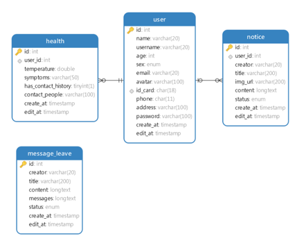

# epidemic-master

> ​	 使用前后端分离架构。后端基于springboot开发的社区疫情管理服务；前端基于react构建的用于社区工作者的后台管理系统；使用taro构建的面向社区用户的客户端。

## epidemic-backend

springboot + redis + mysql 实现的后端服务
（tips：静态资源如果加载不出来，请检查yaml配置的路径以及代码中的配置类。本实现基于windows环境构建。）

## epidemic-manage

react + arco-ui + umi-request 实现的后台操作界面

## epidemic-mini

taro + taro-ui + taro-request 实现的客户端用户界面

## E-R图

## 特别鸣谢
- [ArcoDesign](https://www.iconfont.cn/user/detail?spm=a313x.7781069.1998910419.d9bd4f23f&uid=207078&nid=XqJypKOvb165) - 本系统前端UI库

- [ChenCJ](https://www.iconfont.cn/user/detail?spm=a313x.7781069.1998910419.d9bd4f23f&uid=207078&nid=XqJypKOvb165) - 本系统图标库作者
